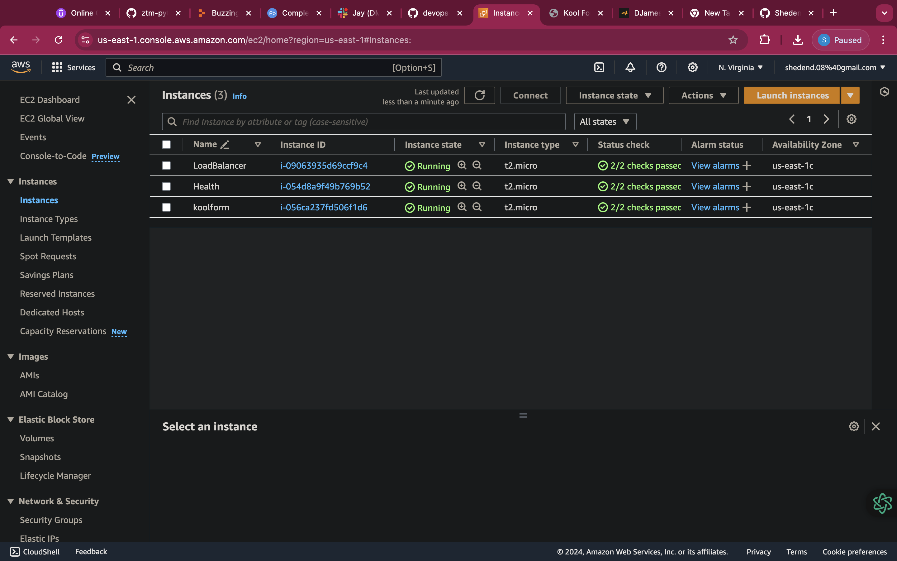

# Project 3: Setup Load Balancing for Static Websites Using Nginx

## Introduction

This project allowed me to gain valuable insights into optimizing server performance and ensuring seamless user experiences for static websites.

## Kind of Load Balancer

Implementing Nginx as a reverse proxy load balancer significantly improved the overall stability and responsiveness of our web infrastructure.

## Step 1: Deploying Three Servers

This step involves the setting up three separate servers:

1. Two servers hosted static websites
2. The third server was assumed to be our load balancer
3. In this step also I Deployed and set up three Ubuntu servers.



## Step 2: Setting up static websites

I used Nginx to setup the static websites on the health and kool form servers

1. By setting up Nginx to serve unique HTML content on each server, I were was to effectively manage and direct specific web traffic based on our distinct server configurations.

_**sudo apt update**_
_**sudo apt upgrade**_
_**sudo apt install nginx**_
_**sudo systemctl start nginx**_

2. This approach allowed me to test the load balancing capabilities of Nginx while ensuring that each server's unique content was accurately displayed to users. 

## Step 3: Configuring Nginx as a Load Balancer

I configured the third server to act as a load balancer:

1. I installed Nginx and set up the load balancing configuration to distribute requests between the two website servers


    ```bash
    sudo vim /etc/nginx/nginx.conf
    ```

   Added the following block in http part:

    ```nginx
     upstream shedend {
                server 54.166.92.243;
                server 52.206.36.226;
        }

        server {
                server_name shedend.xyz www.shedend.xyz;

                  location / {
                        proxy_pass http://shedend;
            }
      }
    ```

2. I tested and restarted Nginx to apply the new configuration.


## Step 4: DNS Configuration

I ensured public access to the load balancer by adding an A record for it in DNS and directing my domain to the Nginx load balancer server's IP address.


## Step 5: Securing the Websites with SSL/TLS

1. I used Certbot on the load balancer server to acquire and set up SSL certificates for the domain.

_**sudo certbot --nginx -d shedend.xyz -d www.shedend.xyz**_

2. I verified the security by accessing the websites through HTTPS and using OpenSSL to examine the SSL certificate.

_**openssl s_client -connect shedend.xyz:443**_


**END OF PROJECT 3**


