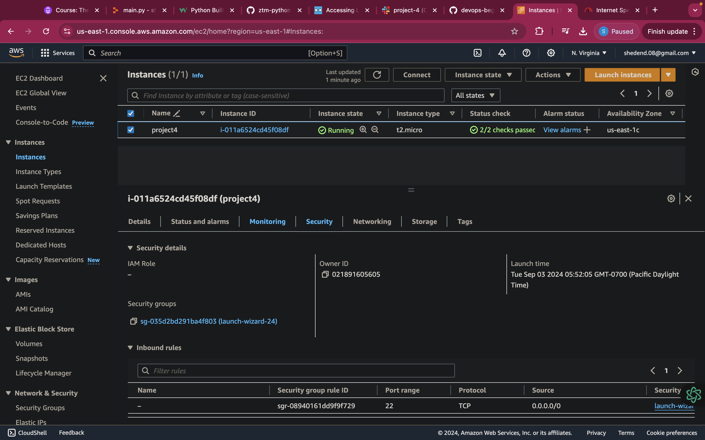
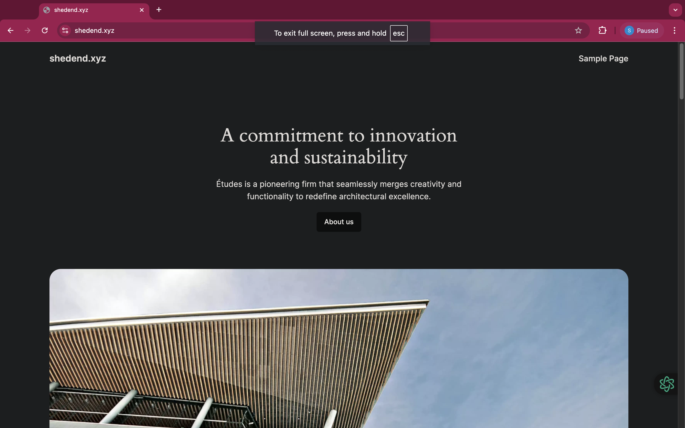

# PROJECT 4

# Setup Wordpress Website Using LAMP Stack 

In my fourth project, I advanced on setting up a Wordpress Website using the **LAMP(LINUX, APACHE, MySQl and PHP)** stack. This setup gave me the knowledge on how to deploy a Wordpress platform.

## Step 1: Deploying of my Ubuntu server:

I had to deploy and Ubuntu server on AWS EC2 and allocate and Elastic IP to my instance



## Step 2: Setting up LAMP Stack on the server.

I had to install the LAMP components in this step using the following commands:

1. **Apache Installation:**

```bash
sudo apt update
sudo apt install apache2
sudo systemctl start apache2
```
2. **MySQL Installation:**

```bash
sudo apt install mysql-server
sudo mysql_secure_installation
```
3. **PHP Installation:**

```bash
sudo apt install php libapache2-mod-php php-mysql
```
The LAMP stack was successfully installed on my server

## Step 3: Configuring WordPress

The next step was to proceed to configuring WordPress on the LAMP Stack

1. **WordPress Download and Setup:**

```bash
cd /var/www/html
sudo wget http://wordpress.org/latest.tar.gz
sudo tar -xvzf latest.tar.gz
```
2. **Database Configuration for Wordpress:**
```bash
sudo mysql -u root -p
CREATE DATABASE wp_db;
GRANT ALL PRIVILEGES ON wordpress_db.*TO 'shedend'@'localhost' IDENTIFIED BY 'password'
FLUSH PRIVILEGES;
```
After I ran this commands the WordPress was configured and the database was set.

## Step 4: DNS Configuartion and Mapping

I had to create a record for the server's IP to link my domain to the Wordpress site.

## Step 5: Securing the Website with SSL/TLS
 I ran the  following command to enhance the security and also installed SSL Certificates using Certbox:

 ```bash
 sudo apt-get install certbot python3-certbot-apache
 sudo certbot --apache -d shedend.xyz -d www.shedend.xyz
 ```

 

 # END OF PROJECT